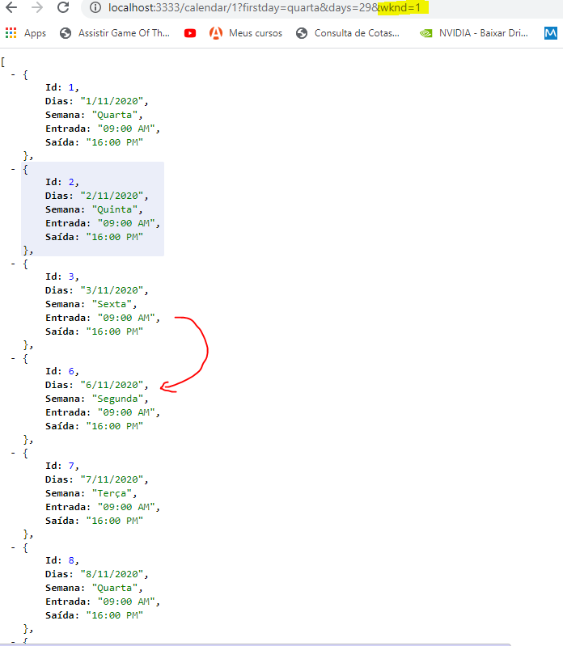

# workTime

Este programa tem como intuito gerar um relatório para preencher as horas trabalhadas no mês

# Esta é a api que fornece os dados para o frontEnd

# COMO FUNCIONA

1. Existe uma requisição possível, que é tipo GET.
2. Os parâmetros são passados através da URL e são do tipo PARAMS e QUERY.
3. A aplicação inicia no http://localhost:3000
4. Você precisa passar o /calendar que é a primeira rota /id que é a segunda
5. O id precisa ser um numero de 0 a 11 que representa cada mês do ano
6. E depois o ultimo parametro é um query que representa o dia da semana,
   que sera passado assim: ?firstday=diaDaSemana depois do id.

# A forma como os dias da semana são aceitos é a seguinte:

1. domingo
2. segunda
3. terça
4. quarta
5. quinta
6. sexta
7. sábado

# Tudo em letras minusculas e sem esquecer as ascentuações

1.  No final ficará assim: http://localhost:3000/calendar/0/firstday=segunda
    

# No caso do mês de fevereiro você precisará passar um query params adicional (days) informando a quantidade de dias:

2.  Exemplo: http://localhost:3000/calendar/1?firstday=segunda&days=29
    

<h4>   
3.  Também existe a possiblidade de eliminar os fins de semana, através do envio de um terceiro query params (wknd), se não quiser incluir os fins de semana passe como valor o número 1 wknd = 1, se quiser incluir é só não passar esse parâmetro. Exemplo: http://localhost:3333/calendar/1?firstday=quarta&days=29&wknd=1
</h4>

